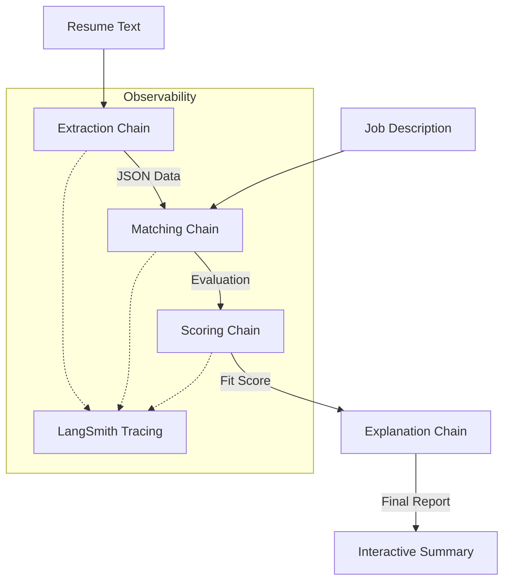

# 🚀 SmartRecruit: AI-Powered Resume Screening System

[](https://www.python.org/)
[](https://langchain.com/)
[](https://groq.com/)
[](https://smith.langchain.com/)

An advanced, end-to-end resume evaluation pipeline built with **LangChain (LCEL)** and **Groq Cloud**. This system automates the tedious task of matching candidates to job descriptions with high precision and transparent reasoning.

---

## 🌟 Key Features

- **⚡ Lightning Fast AI**: Powered by Groq's Llama-3 for near-instant inference.
- **🔍 Precision Extraction**: Strips skills, experience, and tools into structured JSON.
- **📊 Intelligent Scoring**: Algorithmic fitness scoring based on semantic matching.
- **💬 Explorable Reasoning**: Generates detailed pros/cons for every candidate.
- **🛠️ Production Observability**: Full execution tracing via **LangSmith**.
- **🐞 Fault Tolerance Demo**: Includes a built-in debugging module to demonstrate how to catch and fix LLM hallucinations/parsing errors.

---

## 🏗️ System Architecture



---

## 🛠️ Tech Stack

- **Framework**: [LangChain](https://www.langchain.com/) (using LCEL)
- **Model**: `Llama-3-8b-8192` (via Groq)
- **Observability**: [LangSmith](https://smith.langchain.com/)
- **Parsing**: `JsonOutputParser`, `StrOutputParser`

---

## 🚀 Quick Start

### 1. Prerequisites
Ensure you have Python 3.8+ installed.

### 2. Installation
```bash
git clone https://github.com/Chinmay-Jain-29/Innomatics-Research-Labs-Assignments-.git
cd "GENAI/IN226108102_GENAI/GENAI_TASK 3 (Resume Screening System)"
pip install -r requirements.txt
```

### 3. Environment Setup
Create a `.env` file in the root directory:
```env
GROQ_API_KEY=your_groq_key
LANGCHAIN_TRACING_V2=true
LANGCHAIN_API_KEY=your_langsmith_key
LANGCHAIN_PROJECT="Resume-Screener"
```

### 4. Run Evaluation
```bash
python main.py
```

---

## 📈 Debugging with LangSmith

This project demonstrates professional-grade debugging techniques. 

### The "Intentional Failure" Scenario
Execute `run_debug_demo()` in `main.py` to simulate a pipeline failure.
- **The Error**: The LLM is forced to return unstructured text instead of JSON.
- **The Fix**: Open your **LangSmith Dashboard**, filter by tag `debug_demo`, and visualize the exact point of the `OutputParserException`. 

> [!TIP]
> Use this to identify where prompt engineering needs to be tightened or where your LLM is hallucinating technical data!

---

## 📂 Project Structure

```text
├── chains/             # Specialized LCEL chains (Extraction, Scoring, etc.)
├── prompts/            # Sophisticated Prompt Templates
├── data/               # Demo resumes (Strong, Average, Weak)
├── main.py             # Entry point / Execution Logic
├── requirements.txt    # Dependencies
└── .env                # API Keys (Ignored)
```

---

<p align="center">
  Developed with ❤️ for Innomatics Research Labs
</p>
